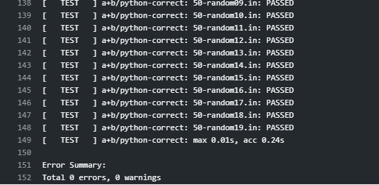
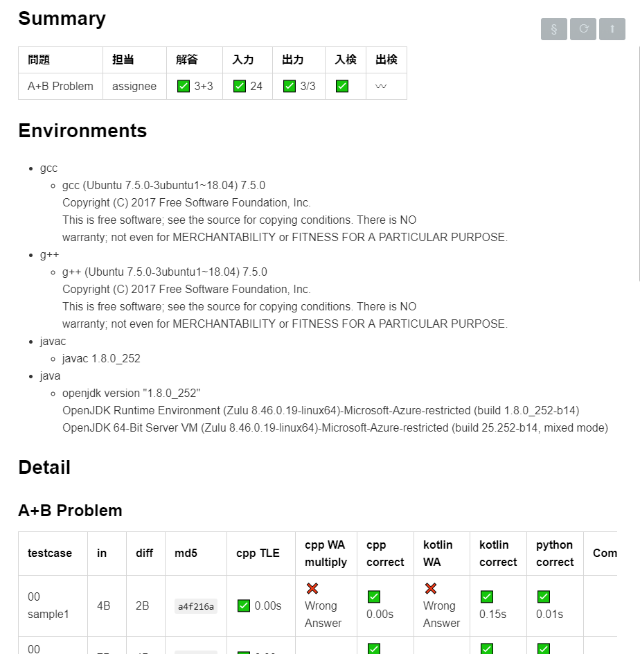

# rime_example
This repository is an example for preparing contest using [rime](https://github.com/icpc-jag/rime).

## 概要

icpc/jag で開発しているrimeを用いたコンテスト準備用リポジトリのサンプルです。
ジャッジ解やジャッジケースの管理に用います。

### GitHub-Actions

このテストリポジトリではGitHub-Actionsのサンプルを提供しています。
Artifactとして、次のものを生成します。
- summary.(date).zip (summary.md : テスト実行結果のサマリーおよび詳細を報告するドキュメント)
- packed_example.(date).zip (各問題の入出力をまとめたもの)

なお、これらを生成するためにrimeの `markdownify_full`コマンドおよび `pack`コマンドを用いています。
詳細は `.github/workflows/testrun.yml` および `pack_example_for_aoj.sh` を確認ください。

### イメージ

それぞれ、`markdownify_full`コマンド実行の一部と、生成されたsummary.mdファイルの一部

